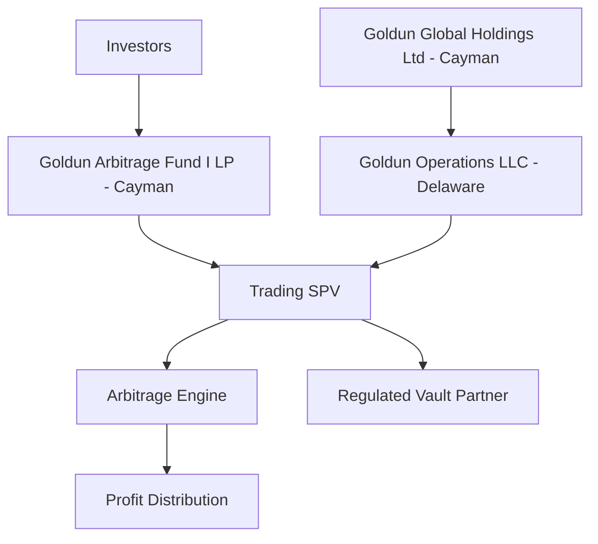

# Goldun Legal Structure (Cayman + Delaware SPV)

## Entity Stack
- Top holding: Goldun Global Holdings Ltd (Cayman)
- Subsidiary: Goldun Operations LLC (Delaware)
- SPV: Goldun Arbitrage Fund I LP (Cayman)
- Custody: Regulated vault partner

## Capital Flow
Investors → Cayman Fund LP → Trading SPV → Arbitrage Engine → Profit Distribution

## Mermaid Diagram

## Build Instructions
1. Keep final signed constitutional docs for Cayman entities in legal data room.
2. Keep Delaware LLC operating agreement aligned with investor rights matrix.
3. Map each investor class to LP economics and governance rights.
4. Add compliance reviews for custody counterparties before opening new SPVs.
5. Version control legal artifacts by jurisdiction in your internal legal repository.
